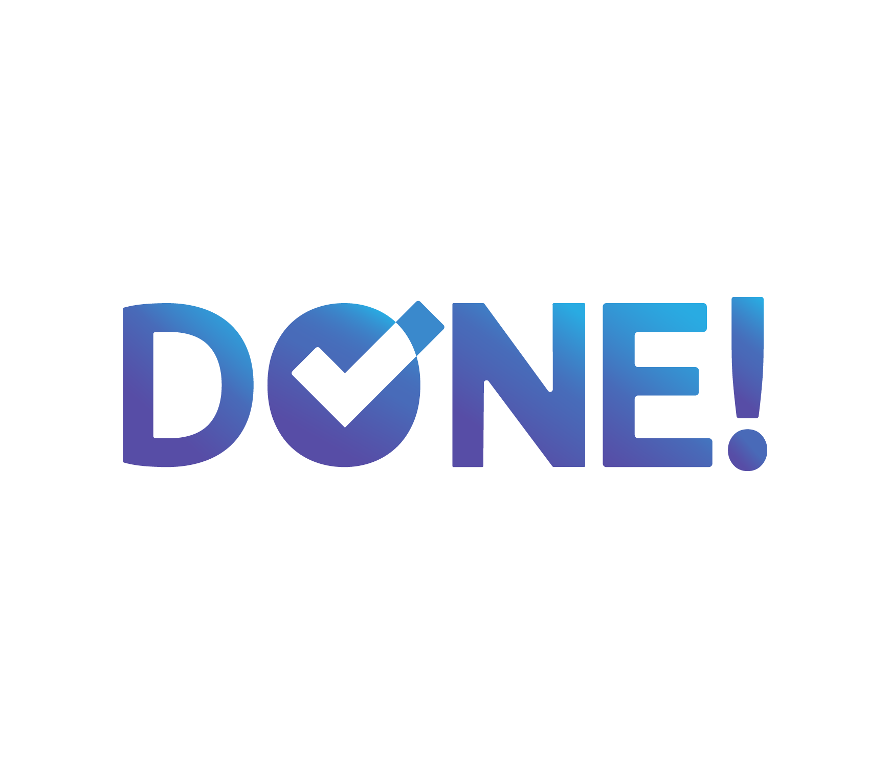
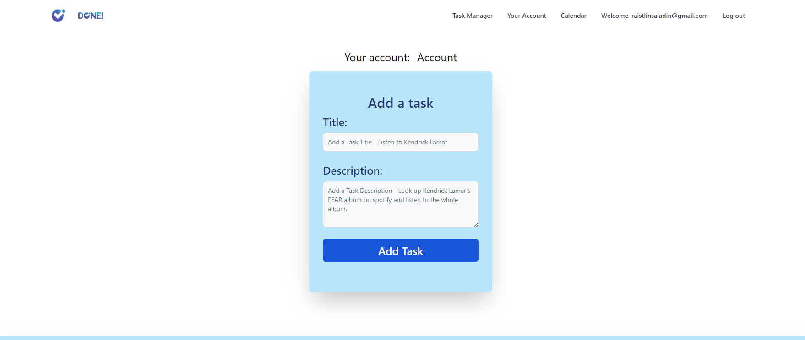

<!-- PROJECT LOGO -->
 

  
  <h2 align="center">Task Web Page</h2>
  <a href="https://task-web-ironhack.vercel.app/auth/login">Visit Website</a>

<!-- TABLE OF CONTENTS -->

  
Table of Contents

  <ol>
    <li>
      <a href="#about-the-project">About the Project</a>
      <ul>
        <li><a href="#build-with">Build with</a></li>
      </ul>
    </li>
    <li>
    <a href="#roadmap">Roadmap</a>
     <ul>
     <li><a href="#backlog">Back log</a></li>
        <li><a href="#day-one">Tuesday 07, February 2023</a></li>
        <li><a href="#day-two">Wednesday 08, February 2023</a></li>
        <li><a href="#day-three">Thursday 09, February 2023</a></li>
        <li><a href="#day-four">Friday 10, February 2023</a></li>
        <li><a href="#day-five">Wednesday 15, February 2023</a></li>
        <li><a href="#day-six">Thursday 16, February 2023</a></li>
        <li><a href="#day-seven">Monday 20, February 2023</a></li>
        <li><a href="#day-eight">Tuesday 21, February 2023</a></li>
      </ul>
    </li>
    <li><a href="#about">About</a></li>
    <li><a href="#special-thanks">Special Thanks</a></li>
    <li><a href="#technical-challenge">Technical Challenge</a></li>
    <li><a href="#big-mistake">Big Mistake</a></li>
  </ol>

<!-- ABOUT THE PROJECT -->

## About the Project

This is my finalterm project of the FrontEnd web development bootcamp from Ironhack. The purpose of this project is to demonstrate the knowledge acquired as a web developer and teach everything I have learned throughout the course.

I have created the website using the VUE framework and the Tailwind library to style it, as well as some other libraries to add functionality.

The web has:

- A SignUp and SignIn components that allows the user to register and connects to the database in Supabase to save the user.

- A Home view showing the Nav component, NewTask, and TaskItem. This allows the user to move between the different views with the Nav, add new tasks and display the tasks that are saved in the database that are linked to the user.

- A Profile view that displays an avatar and other user data and is connected to the Edit view that allows you to upload an image to change the avatar and other fields displayed in the Profile view.

- A Calendar view that, apart from the Nav, has a calendar that shows the days and if tasks have been completed that day, the color of that day is highlighted. It also has a dropdown selector that shows us an image that represents a status response from HTTP calls. This is connected to the HTTP.cats website.

(<a href="#readme-top">back to top</a>)

### Build with

For this project I have used the <a href="https://vuejs.org">VUE</a> framework (HTML, JS) together with the <a href="https://tailwindcss.com">Tailwind</a> (CSS) library, as well as other libraries such as fullcalendar. The project is connected to a <a href="https://supabase.com">Supabase</a> database and the <a href="https://vercel.com">Vercel</a> page is used to host the project.

(<a href="#readme-top">back to top</a>)

## Roadmap

#### Day One

###### Tuesday 07, February 2023

- [x] Modify SignIn component
- [x] Test the connection with supabase and confirm it's correct
- [x] Add a user
- [x] Add task and test it works correctly

#### Day Two

###### Wednesday 08, February 2023

- [x] Add logic to modify tasks (task store and TaskItem component)
- [x] Add logic to change the tasks's status (task store and TaskItem component)
- [x] Start writing the README file
- [x] Create profile table in supabase
- [x] Modify Account view to show the content of the user profile
- [x] Create Edit view to edit the content of the user profile

#### Day Three

###### Thursday 09, February 2023

- [x] Find out how to remove the glitch when entering on Account view
- [x] Learn how to use Tailwind and apply it to the project
- [x] Style SignUp and SignIn components
- [x] Style Home view and NewTask and TaskItem components

#### Day Four

###### Friday 10, February 2023

- [x] Add a Modal component to Delete a Task
- [x] Style Account and Edit views
- [x] Add Logic to user store to upload images to avatar storage in supabase
- [x] Think what to add a task web application

#### Day Five

###### Wednesday 15, February 2023

- [x] Update README
- [x] Restyle all components
- [x] Added Filter option by status to tasks
- [x] Added button to show password to user

#### Day Six

###### Thursday 16, February 2023

- [x] Add CompleteWhenDate column to task table
- [x] Create a Calendar component to show a calendar the days that Task are completed (color more intense when more task are completed)

#### Day Seven

###### Monday 20, February 2023

- [x] Complete tasks from previous days
- [x] Add component to show HTTP.cats
- [x] Add Style to Calendar view
- [x] Add Style and Disabled option to del/modify task btns
- [x] Add BackToTop component (button)

#### Day Eight

###### Tuesday 21, February 2023

- [x] Change logic to use less fetch in task store.
- [x] Complete Readme
- [ ] Create project presentation

(<a href="#readme-top">back to top</a>)

<!-- Acerca de mi -->

## About

Joaquim Crous - [@raistbear](https://twitter.com/raistbear) - joaquimcrous@gmail.com

Project Link: [https://github.com/QuimCrous](https://github.com/QuimCrous/midterm-ironhack)

Presentation Link: [https://www.linkedin.com/in/joaquim-crous-mayné/](https://www.linkedin.com/in/joaquim-crous-mayné/)

#### Academic experience

- Backend Web Development Java - Ironhack Barcelona

- Fronted Web Development - Iroonhack Barcelona

(<a href="#readme-top">back to top</a>)

<!-- ACKNOWLEDGMENTS -->

## Special Thanks

- Thank all my bootcamp colleagues for the support and for sharing information with each other in order to improve our projects.
- To our teachers for helping us with our doubts and giving us support.
- To my brother for facilitating the task of searching for resources and helping me to propose the logic of certain scripts.
- To my partner and friends for trusting me and my potential.
- [Páginas de consulta](https://www.w3schools.com/js/default.asp)
- [Páginas de ChatGPT](https://openai.com/blog/chatgpt/)

(<a href="#readme-top">back to top</a>)

## Technical Challenge

- What I consider to have been a challenge is completing a website with VUE and learning how to use the Tailwind library. Being the styling of the websites my biggest complication, Tailwind has solved it allowing me to focus more on the logical part.
- Also the use of fullcalendar has been complicated but following the documentation of the library plus the help of teachers I have achieved the goal that I had set myself.
- Finally, the problem that has cost me the most is to think about what utilities to add to the project to show my skills while being logical to put on the web.

(<a href="#readme-top">back to top</a>)

## Big Mistake

My big mistake in this project has been less than in the previous project. I have been more aware of the skills that I have and I have tried to keep things on my level. Although the part of creating the calendar has been the most complicated and still visually it is not what I had in mind.

Even so, I have achieved an acceptable result and it does the functionality that I wanted.

(<a href="#readme-top">back to top</a>)

